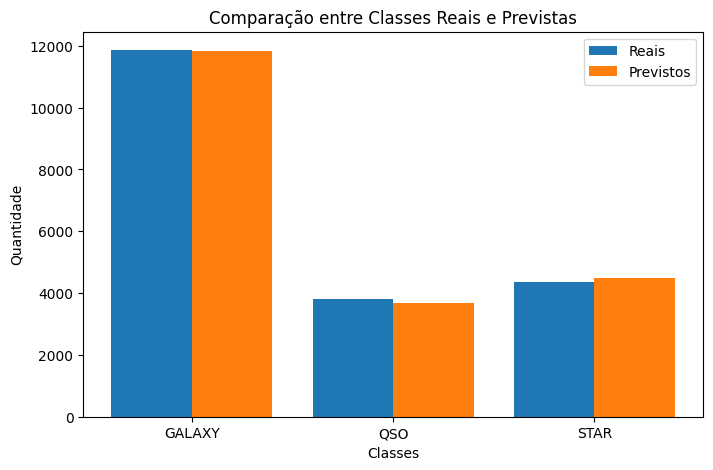
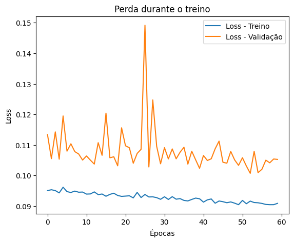
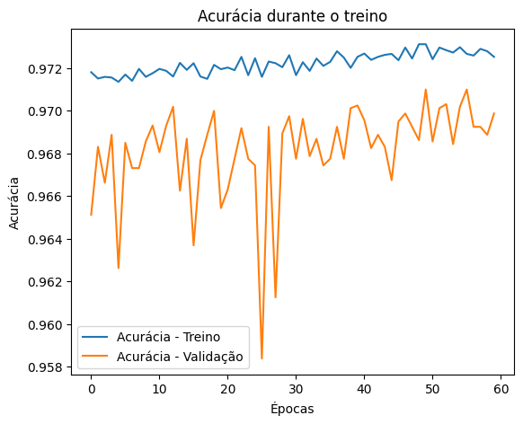
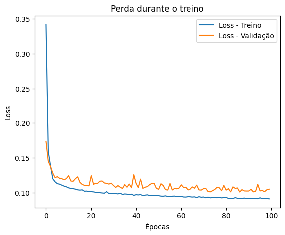
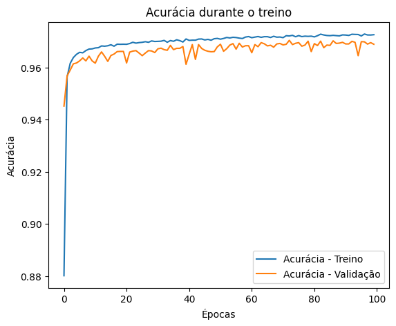

# 🔍 Análise Exploratória

Nosso conjunto de dados possui três classes: **Galaxy**, **Star** e **QSO**.

O objetivo inicial é **identificar padrões e compreender o comportamento dessas classes**.

As variáveis selecionadas para essa análise foram: **`u`**, **`g`**, **`r`**, **`z`** e **`redshift`**.

## 🧠 Primeira Hipótese

Quando o valor de **`redshift`** é **alto**, existe uma maior probabilidade de o objeto ser uma **QSO (Quasar)** ou uma **galáxia**.

Por outro lado, quando o valor de **`redshift`** é **menor que 1**, há maior probabilidade de o objeto ser uma **estrela**, pois objetos estelares estão mais próximos da Terra e, portanto, apresentam um **redshift** mais baixo.

---

# 🔗 Modelagem com Redes Neurais

## 🔸 Primeira Rede Neural

```
┌───────────────────────────────┬───────────────────────┬────────────────┐
│ Camada                         │ Saída (Shape)         │ Parâmetros     │
├───────────────────────────────┼───────────────────────┼────────────────┤
│ Dense (dense_1)                │ (None, 16)            │ 192            │
│ Dense (dense_2)                │ (None, 16)            │ 272            │
│ Dense (dense_3)                │ (None, 3)             │ 51             │
└───────────────────────────────┴───────────────────────┴────────────────┘
```
- **Acurácia:** 0.96845

 <br>
*Figura 1 - Comparação de previsão e valor real (do primeiro modelo).*
---
#### 🔸 Na primeira tentativa, utilizei a função de ativação ReLU, com 16 neurônios na primeira e na segunda camada, e 3 neurônios na camada de saída, correspondentes às três classes do problema. Essa configuração resultou em uma acurácia de 0.96845. 

#### 🔸 Em seguida, decidi testar diferentes arquiteturas, sem me preocupar, inicialmente, com ajustes mais finos como backpropagation, regularização ou otimização dos hiperparâmetros.

#### 🔸 Segunda Rede Neural Comparação de previsão e valor real (do primeiro modelo), que o valor real vs o valor previsto, em outros modelos nao vai ter esse grafico por que nao chega uma coisa diferente para todos.

```
┌───────────────────────────────┬───────────────────────┬────────────────┐
│ Camada                         │ Saída (Shape)         │ Parâmetros     │
├───────────────────────────────┼───────────────────────┼────────────────┤
│ Dense (dense_4)                │ (None, 16)            │ 192            │
│ Dense (dense_5)                │ (None, 8)             │ 136            │
│ Dense (dense_6)                │ (None, 6)             │ 54             │
│ Dense (dense_7)                │ (None, 6)             │ 42             │
│ Dense (dense_8)                │ (None, 3)             │ 21             │
└───────────────────────────────┴───────────────────────┴────────────────┘
```
- **Acurácia:** 0.96365




---
#### 🔸 Na segunda rede, aumentei o número de camadas e distribuí os neurônios entre elas, com o objetivo de verificar se isso aumentaria o nível de acurácia. Além disso, passei a observar também o comportamento da função de perda (loss function).

#### 🔸 O modelo atingiu uma acurácia de 0.96365, porém, ao plotar o gráfico de perda, percebi que o loss não estava convergindo para um valor estável, indicando possível dificuldade no ajuste dos pesos ou problemas relacionados à arquitetura escolhida.


## 🔸 Terceira Rede Neural

```
┌───────────────────────────────┬───────────────────────┬────────────────┐
│ Camada                         │ Saída (Shape)         │ Parâmetros     │
├───────────────────────────────┼───────────────────────┼────────────────┤
│ Dense (dense_19)               │ (None, 16)            │ 192            │
│ Dense (dense_20)               │ (None, 8)             │ 136            │
│ Dense (dense_21)               │ (None, 8)             │ 72             │
│ Dense (dense_22)               │ (None, 3)             │ 27             │
└───────────────────────────────┴───────────────────────┴────────────────┘
```
- **Acurácia:** 0.97205





#### 🔸 Na terceira rede treinada, utilizei uma arquitetura com 16 neurônios na primeira camada, seguido de duas camadas com 8 neurônios cada, e uma camada de saída com 3 neurônios. Observei um aumento na acurácia, que chegou a 0.97205.
#### 🔸 Após plotar o gráfico da função de perda, percebi que o loss estava convergindo corretamente para um valor estável. Realizei também a análise do backpropagation e confirmei que o modelo estava de fato convergindo.
#### 🔸 Testei algumas variações, como o aumento do número de camadas, mas essas mudanças não impactaram significativamente a acurácia final.
---
#### Conclusao:  Vi que o terceiro modelo se saiu melhor que todos, explorei outros nives de camadas, vi que os numeros de camdas nao siginifcas um bom resultado e nem se aumentar os niveis de neuronios aumenta a qualidade do modelo. 
